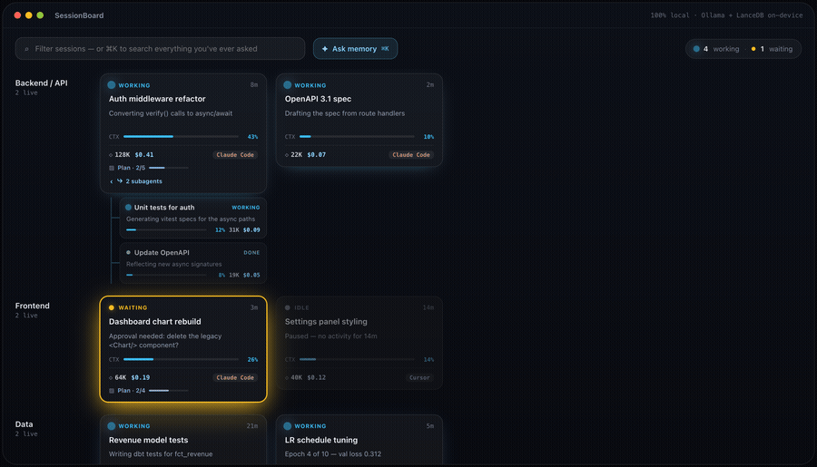

# taisk

**Every Claude Code session you've got running, on one live board — auto-categorized, searchable, 100% local.**

You open a terminal. You open Claude Desktop. You start three more sessions chasing three different bugs. Ten minutes later you can't remember which one is waiting on you, which one finished, and which one's been quietly sitting idle since lunch. taisk fixes that: it watches every Claude Code session on your machine and turns them into live cards on a board — grouped by what you're actually working on, updated in real time, searchable by meaning, not just keywords.

No cloud, no accounts, no API keys. Every model call happens on your machine.


---



*The board this app is being built to match — from the designer's [interactive prototype](docs/design/live-board/SessionBoard.html) (live data and app chrome are still in progress).*

## What it does

- **Live board.** Every Claude Code session (CLI or Desktop) shows up as a card the moment it starts — no setup, no manual registration.
- **Auto-categorization.** A small local LLM reads what you're actually working on and groups sessions into categories on its own — "Node.js/npm installation failed," "Weather Information," whatever you're actually doing — not a static project list you have to maintain.
- **Real state, not a guess.** Each card tracks a proper state machine: **Working** → **Waiting** (blocked on you — a permission prompt or an interactive question) → **Done** (the session actually ended), plus **Idle** for anything that's gone quiet without a clean exit. State changes are driven by Claude Code's own hooks, not polling or heuristics layered on top of vibes.
- **Semantic memory.** Every session's intent gets embedded into a local vector store. Hit ⌘K and ask "have I done something like this before?" in plain language — it searches meaning, not just substring matches.
- **Approve from the board.** A session blocked on a permission prompt can be approved, rejected, or replied to right from the card's drawer — no alt-tabbing back to find the right terminal.
- **Jump back in.** One click reattaches to a CLI-originated session (`claude --resume <id>`) in a fresh terminal, in the right directory.
- **Survives restarts.** Close the app, reopen it — your board comes back with real categories and real state, reconstructed from durable local storage, not a blank slate.

## Why it's local-first

Every piece of intelligence in taisk runs on your machine, on free, open infrastructure:

| Piece | Tech | Why |
|---|---|---|
| Embeddings | [Ollama](https://ollama.com) + `nomic-embed-text` | Fast, small, good enough for semantic session search |
| Categorization / summaries | Ollama + `qwen2.5:1.5b` | Tiny instruct model, cheap enough to call constantly without hammering your machine |
| Vector search | [LanceDB](https://lancedb.com) (embedded) | Ships as a Rust crate — no server, no Docker, just a folder on disk |
| Everything else | Rust + Tauri | Native performance, tiny idle footprint — this is meant to sit in the background all day |

Nothing leaves your machine. There's no account to create and no API key to paste in.

## Architecture, in one picture

```
Claude Code hooks  ──▶  hook-bridge (tiny Rust bin)  ──▶  Unix socket  ──▶  Core Engine
                                                                              │
                                                     ┌────────────────────────┼────────────────────────┐
                                                     ▼                        ▼                        ▼
                                          Session state machine      Ollama (categorize +      LanceDB (memories +
                                          (single-owner actor)        embed, async)              category exemplars)
                                                     │
                                                     ▼
                                       axum HTTP/WS API (localhost)
                                                     │
                                                     ▼
                                     React + Zustand + Framer Motion UI
```

- **One collector per tool.** Today that's Claude Code, wired in behind a `Collector` trait — adding VS Code/Cursor/another tool later means writing a new adapter, not touching the engine, the UI, or the vector store.
- **One state machine, one place mutations happen.** A single tokio actor owns the live session map; every change goes through an explicit `transition(state, event)` function and broadcasts a diff. No shared mutexes, no scattered "just set it to Working here too" patches.
- **Two LanceDB tables, on purpose, not more.** `memories` (session text + embeddings, doubles as the search index) and `category_exemplars` (one row per known category). No ORM, no second database for bookkeeping.

## Getting started

You'll need:

```bash
# Rust + Node — build tooling, not shipped to end users
brew install rust node

# Ollama — the local inference runtime
brew install ollama
ollama pull nomic-embed-text
ollama pull qwen2.5:1.5b
```

Then:

```bash
npm install
npm run tauri dev
```

On first run, taisk registers its hooks into `~/.claude/settings.json` (idempotently — safe to run repeatedly, and it only ever touches its own entries) and creates its local data directory at `~/Library/Application Support/taisk` (an embedded LanceDB store — just files on disk, nothing to install).

## Design reference

The board UI follows a high-fidelity design handoff from the project's designer — final colors, typography, spacing, motion, and interactions, all specified so they can be reproduced faithfully in the real app. The GIF above is captured straight from the prototype below (mocked data and simulated state changes stand in for the real Core Engine; the look, motion, and interactions are the real target).

- [`docs/design/live-board/SessionBoard.html`](docs/design/live-board/SessionBoard.html) — the full interactive prototype (the "Swimlanes · Cool & technical" direction, view 2a). Open it in a browser to click around live.
- [`docs/design/live-board/HANDOFF.md`](docs/design/live-board/HANDOFF.md) — the full written handoff: component specs, state-dependent card styling, design tokens (colors/type/radii/spacing), and keyframe timing.
- [`docs/design/live-board/session_board_prd.md`](docs/design/live-board/session_board_prd.md) — product requirements the design implements.

## Project layout

```
sessionboard/
├─ src/                        # React + TypeScript frontend (Vite)
│  ├─ components/              # Board, Swimlane, SessionCard, DetailDrawer, AskMemoryOverlay...
│  └─ store/                   # Zustand store + selectors
└─ src-tauri/
   ├─ src/                     # Tauri entrypoint (window, native commands)
   └─ crates/
      ├─ core-engine/          # State machine, LanceDB repo, Ollama client, hook orchestration, HTTP/WS API
      └─ hook-bridge/          # Tiny binary Claude Code's hooks actually invoke
```

## Testing

```bash
cd src-tauri && cargo test --workspace   # Rust: state machine, hook wiring, API, memory repo
npm run build                            # TypeScript + frontend build
```

The Rust suite includes real end-to-end fixtures — fake hook events driven through a real Unix socket into a real (temp-dir) LanceDB instance — not just unit tests in isolation.

## Roadmap

- [x] Live board with real-time state (Working / Waiting / Idle / Done)
- [x] LLM-based auto-categorization with confidence thresholds
- [x] Semantic memory search (⌘K)
- [x] Jump back into a CLI session
- [x] Collapsible categories
- [ ] Drag a session between categories
- [ ] Token spend / context window per session
- [ ] Subagent sessions shown under their parent
- [ ] A second collector — VS Code / Cursor / beyond

---

*Built to answer one question at a glance: what's actually going on across every AI coding session I've got open right now?*
