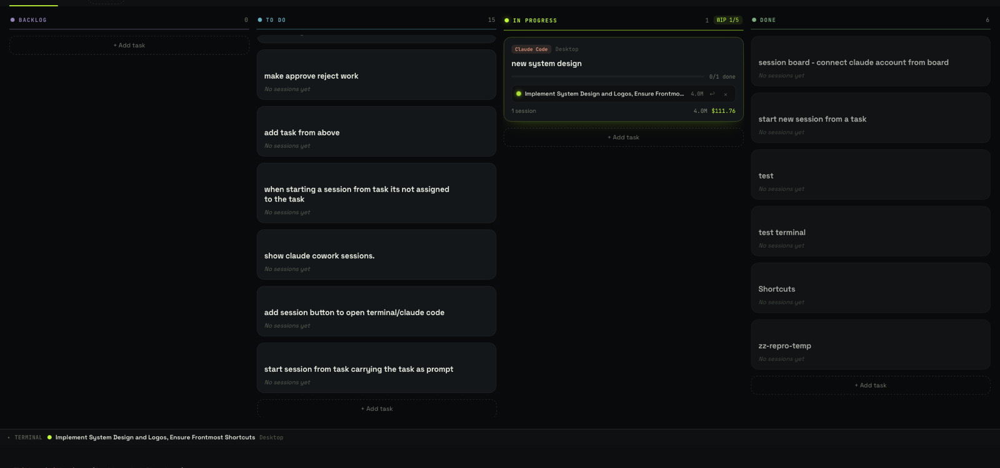
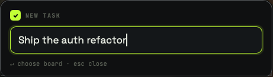
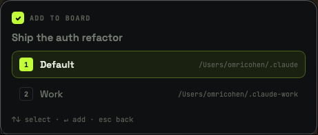
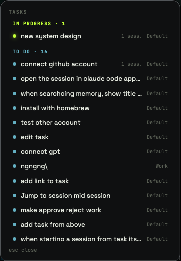
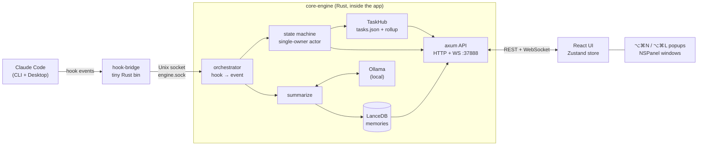
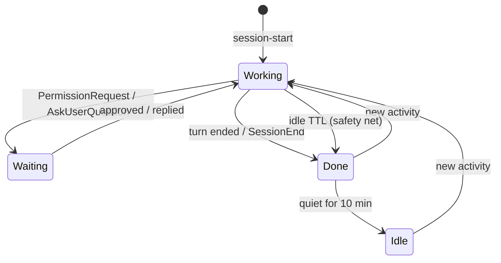

<p align="center">
  
</p>

<h1 align="center">ta<span>✓</span>sk</h1>

<p align="center">
  <strong>A live Kanban board for every Claude Code session on your machine.</strong><br>
  Drag sessions onto tasks, see who's working and who's waiting on you, search everything you've ever asked — 100% local.
</p>

<p align="center">
  
  
  
</p>

<p align="center">
  
</p>

---

## Why

You open a terminal, then Claude Desktop, then three more sessions chasing three different bugs. Ten minutes later you can't say which one is waiting on you, which finished, and which has been idle since lunch.

**taisk** watches every Claude Code session (CLI and Desktop), turns each into a live card, and lets *you* file them under tasks on a Kanban board (**Backlog → To Do → In Progress → Done**). Session state is driven by Claude Code's own hooks, so it's real state — not polling and vibes.

No cloud. No accounts. No API keys. Every model call runs on your machine through [Ollama](https://ollama.com).

## Features

- **Live sessions.** A card appears the moment a session starts — no setup per session.
- **Real state machine.** `Working` → `Waiting` (blocked on you: permission prompt or question) → `Done`, plus `Idle` for anything that went quiet without a clean exit.
- **Tasks you own.** Group sessions under tasks by dragging or with the ▾ menu. A task moves to *Done* by itself when all its sessions settle, and back to *In Progress* when one comes back to life.
- **Approve from the board.** Approve, reject or reply to a blocked session from its detail panel.
- **Start a session from a task.** The **+** on a card opens an embedded terminal running `claude`, and files the new session under that task automatically.
- **Multiple accounts.** Each board maps to one Claude config directory, so a work and a personal login live side by side.
- **Semantic memory.** `⌘K` searches everything you've ever asked, by meaning (embeddings in an on-disk LanceDB).
- **Global shortcuts** that work from *any* app, including full-screen ones (see [Demo](#demo)).
- **Survives restarts.** The board is rebuilt from durable local storage, not a blank slate.

## Demo

### 1. Capture a task from anywhere — `⌥⌘N`

Press the shortcut in Chrome, Safari, a full-screen movie, whatever. A small panel appears over it and takes your typing without pulling you out of the app you're in.

<p align="center">
  
</p>

Hit `↵`. With more than one board, a keyboard-only picker follows (`↑↓` / `j k`, `1–9` to jump, `esc` to go back):

<p align="center">
  
</p>

New tasks land in **To Do**.

### 2. Peek at everything — `⌥⌘L`

A read-only floating list of every task, grouped by stage. It sizes itself to its content and scrolls when there are many.

<p align="center">
  
</p>

### 3. A 60-second walkthrough

1. Start the app (`npm run tauri dev`, see [Install](#install)). The board opens empty.
2. In any terminal, run `claude` and send a prompt. A card appears in the **tray** at the top, labelled *Starting…*, then gets a title and summary from your local model.
3. Press **`⌥⌘N`**, type `Fix flaky login test`, hit `↵`. A task lands in **To Do**.
4. Drag the session chip from the tray onto that task. It's now filed, and the task moves to **In Progress** as soon as the session is working.
5. Ask Claude to run a shell command. The card flips to **Needs you** (amber) the instant the permission dialog appears. Click it, hit **Approve** — no alt-tabbing.
6. When the session finishes, the task rolls itself into **Done**.
7. Press **`⌘K`** and ask *"have I fixed a flaky test before?"* — it searches by meaning across every session you've run.

## Install

taisk is a native macOS app (Tauri). It relies on macOS APIs, so macOS is the supported platform.

### Prerequisites

| Tool | Why | Install |
|---|---|---|
| Xcode Command Line Tools | native build tooling | `xcode-select --install` |
| Rust (stable) | backend + Tauri shell | [rustup.rs](https://rustup.rs) |
| Node.js 20.19+ | frontend build (Vite 7) | `brew install node` |
| Ollama | local embeddings + summaries | `brew install ollama` |
| Claude Code | the thing being watched | [claude.com/claude-code](https://claude.com/claude-code) |

### Step by step

```bash
# 1. Clone
git clone https://github.com/omrico94/taisk.git
cd taisk

# 2. Start Ollama and pull the two small models taisk uses
ollama serve &                     # skip if the Ollama app is already running
ollama pull nomic-embed-text       # embeddings for semantic search
ollama pull qwen2.5:1.5b           # session titles + summaries

# 3. Install JS dependencies
npm install

# 4. Run it (first build compiles the Rust workspace — a few minutes)
npm run tauri dev
```

On first launch taisk:

- registers its hooks in `~/.claude/settings.json` (idempotent; it only ever touches its own entries),
- creates its data directory at `~/Library/Application Support/taisk/`,
- reconstructs any sessions from the last 24 hours.

Sessions started **after** taisk is running appear automatically. taisk lives in the menu bar: closing the window only hides it, so the global shortcuts keep working. Quit from the tray icon or `⌘Q`.

### Build a release app

```bash
npm run tauri build
```

The bundle lands in `src-tauri/target/release/bundle/`.

### Troubleshooting

| Symptom | Fix |
|---|---|
| `cargo: command not found` in a fresh shell | `source ~/.cargo/env` |
| Sessions show up but with crude titles | Ollama isn't running or `qwen2.5:1.5b` isn't pulled |
| A session never appears | It must have sent at least one prompt; check `~/.claude/projects/<cwd>/<session>.jsonl` exists |
| Shortcut does nothing | Another app owns `⌥⌘N` / `⌥⌘L`. Change `QUICK_ADD_KEYS` / `PEEK_KEYS` in `src-tauri/src/shortcuts.rs`, or use the tray menu |
| Port 37888 busy | Something else is using the engine's local API port (`API_PORT` in `src-tauri/src/lib.rs`) |

## Architecture

taisk is a Tauri app with three moving parts: a tiny **hook-bridge** binary that Claude Code invokes, a **core engine** (Rust, embedded in the app) that owns all state, and a **React** UI that talks to the engine over localhost.



### The pipeline

1. **Hook fires.** taisk registers Claude Code hooks (`SessionStart`, `PreToolUse`, `PostToolUse`, `PermissionRequest`, `Notification`, `Stop`, `SessionEnd`). Each invokes `hook-bridge`, which reads the payload from stdin, writes it to a Unix socket, and exits in milliseconds. It fails silently if the app isn't running, so it can never break a real session.
2. **Orchestrator** maps the hook to a `SessionEvent`. On `session-start` it waits for the transcript, extracts the first prompt, then asks Ollama for a title and summary *off the critical path* — the card shows up as "Starting…" immediately.
3. **State machine.** One tokio actor owns every live session. Every mutation goes through a single `transition(state, event)` function (table-tested for every pair) and broadcasts a diff. No shared mutexes, no scattered "just set it to Working here too".
4. **Tasks.** `TaskHub` persists tasks and session→task assignments and owns the *Done* rollup. Assignment is always an explicit user action — never inferred.
5. **API.** An axum server on `127.0.0.1:37888` exposes REST (`/sessions`, `/tasks`, `/search`, approve/reject/reply) plus a WebSocket that streams session diffs and task snapshots.
6. **UI.** A React + Zustand app subscribes to the WebSocket, with polling as a safety net for the packaged webview.

### Session states



### Popups over any app

The global-shortcut windows are `NSPanel`s with the *non-activating* style, on a transparent window (via [`tauri-nspanel`](https://github.com/ahkohd/tauri-nspanel)). That's the same trick Spotlight-style launchers use: the panel becomes the key window and accepts typing **without making taisk the active app**, so it appears over Chrome, Safari or a full-screen video without switching Spaces or stealing the Dock. A plain window plus app-activation was tried first and never rendered when Chrome was frontmost.

### Repository layout

```
taisk/
├─ src/                          # React + TypeScript UI (Vite)
│  ├─ components/                # Board, Column, TaskCard, SessionOverlay, TerminalPanel, popups…
│  ├─ store/                     # Zustand store, selectors, WS + terminal hooks
│  └─ styles/                    # design tokens (tokens.css), fonts, animations
├─ src-tauri/
│  ├─ src/                       # Tauri shell: window, tray, global shortcuts, NSPanel popups
│  └─ crates/
│     ├─ core-engine/            # state machine, orchestrator, tasks, API, LanceDB, Ollama client
│     └─ hook-bridge/            # the tiny binary Claude Code's hooks actually run
├─ scripts/                      # Playwright E2E harness (isolated HOME, fake Ollama)
└─ docs/                         # e2e screenshots, design notes, README assets
```

### Where things live

| What | Where |
|---|---|
| App data (tasks, boards, LanceDB, checkpoints) | `~/Library/Application Support/taisk/` |
| Hook socket | `~/Library/Application Support/taisk/engine.sock` |
| Hook registration | `~/.claude/settings.json` (and each extra board's config dir) |
| Session transcripts (read-only) | `~/.claude/projects/<cwd>/<session>.jsonl` |
| Local API | `http://127.0.0.1:37888` |

Everything stays on disk on your machine. If you're upgrading from the old *SessionBoard* name, your data directory is migrated automatically on first launch.

## Development

```bash
npm run dev                      # Vite only — fast for CSS/component iteration
npm run tauri dev                # full app; Rust changes rebuild and relaunch automatically
npm run build                    # tsc typecheck + production build (the lint gate)

cd src-tauri
cargo test --workspace           # ~120 tests: state machine, hook wiring, API, memory repo
cargo test -p core-engine engine::   # just one module
```

The Rust suite includes real end-to-end fixtures — fake hook events driven through a real Unix socket into a real temp-dir LanceDB — not just isolated unit tests. `scripts/e2e-run.sh` adds a Playwright UI suite against an isolated backend.

## Design

The UI follows the **taisk** design system ("Checkbox Intelligence"): one lime accent that only ever means *live*, a near-black green-biased palette, Space Grotesk for human text and JetBrains Mono for machine output. Tokens live in [`src/styles/tokens.css`](src/styles/tokens.css); fonts are bundled locally, so the app never fetches anything at runtime.

| Stage | Colour |
|---|---|
| Backlog | `#A08FC4` dusty lavender |
| To Do | `#6FB9C9` muted teal |
| In Progress | `#C8FF3D` lime |
| Done | `#86B98C` sage |

## Known limitations

- **macOS only** for now (NSPanel popups, Terminal.app hand-off, Unix sockets).
- **DevSwarm sessions** can't be detected as *Waiting* during a pending tool approval — no hook or transcript marker exists for that window.
- **Claude Desktop sessions** can't be jumped into (no deep link to a specific tab); CLI sessions can (`claude --resume`).

## License

No license file yet — add one (e.g. MIT) before accepting contributions.
